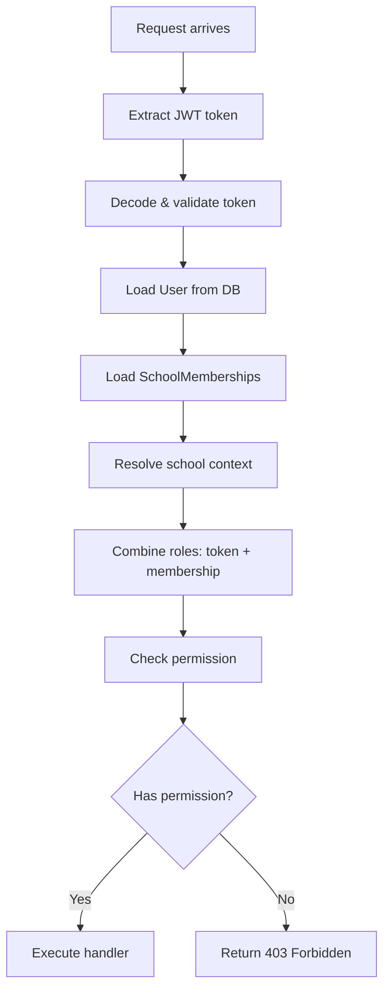

## Overview

Athena implements a **code-first RBAC** (Role-Based Access Control) system. Permissions are defined in code rather than stored in the database, optimizing for simplicity and performance.

<Info>
When schools need configurable permissions, the system can be migrated to a database-backed model.
</Info>

## Role Definitions

Defined in `app/auth/permissions.py`:

```python
class Role(StrEnum):
    RECTOR = "rector"              # Principal
    COORDINATOR = "coordinator"    # Academic coordinator
    SECRETARY = "secretary"        # Administrative staff
    TEACHER = "teacher"            # Teaching staff
    STUDENT = "student"            # Enrolled students
    GUARDIAN = "acudiente"         # Parents/guardians
    SUPERADMIN = "superadmin"      # Platform administrators
```

## Permission Matrix

### SUPERADMIN

Full platform access:

```python
Role.SUPERADMIN: {
    "read:all",
    "write:all",
    "delete:all",
    "manage:schools",
    "config:institution",
    "manage:users",
    "export:simat",
    "read:audit_log",
}
```

### RECTOR (Principal)

Full school-level access:

```python
Role.RECTOR: {
    "read:all",
    "write:all",
    "delete:all",
    "config:institution",
    "manage:users",
    "export:simat",
    "read:audit_log",
}
```

### COORDINATOR

Academic and discipline management:

```python
Role.COORDINATOR: {
    "read:students",
    "read:grades",
    "read:attendance",
    "write:convivencia",      # Discipline cases
    "write:due_process",
    "read:communications",
    "write:communications",
    "export:simat",
}
```

### SECRETARY

Enrollment and communications:

```python
Role.SECRETARY: {
    "read:students",
    "write:enrollment",
    "read:enrollment",
    "write:communications",
    "read:communications",
    "export:simat",
}
```

### TEACHER

Classroom operations:

```python
Role.TEACHER: {
    "read:own_students",     # Only their assigned students
    "write:grades",
    "write:attendance",
    "read:own_grades",
    "write:activities",
    "read:schedule",
    "read:communications",
}
```

### STUDENT

Self-service access:

```python
Role.STUDENT: {
    "read:own_data",
    "read:own_grades",
    "read:schedule",
    "read:communications",
}
```

### GUARDIAN (Parent)

Child monitoring:

```python
Role.GUARDIAN: {
    "read:own_child",
    "read:communications",
}
```

## Permission Checking

### The `has_permission()` Function

```python
def has_permission(roles: list[str], permission: str) -> bool:
    """Check if any of the user's roles grants the requested permission."""
    for role in roles:
        try:
            r = Role(role)
            perms = ROLE_PERMISSIONS.get(r, set())
            
            # Wildcard permissions
            if permission.startswith("read:") and "read:all" in perms:
                return True
            if permission.startswith("write:") and "write:all" in perms:
                return True
            if permission.startswith("delete:") and "delete:all" in perms:
                return True
            
            # Exact match
            if permission in perms:
                return True
        except ValueError:
            continue
    return False
```

### Wildcard Permissions

Roles with `read:all`, `write:all`, or `delete:all` automatically have access to all permissions with that prefix:

- `read:all` → grants `read:students`, `read:grades`, `read:attendance`, etc.
- `write:all` → grants `write:enrollment`, `write:grades`, `write:attendance`, etc.
- `delete:all` → grants all delete operations

## Authentication Context

The `AuthContext` dataclass provides complete user context:

```python
@dataclass(slots=True)
class AuthContext:
    user: User                                    # Current user
    payload: TokenPayload                         # JWT payload
    membership: SchoolMembership | None = None    # Active school membership
    school: School | None = None                  # Current school
    memberships: list[SchoolMembership] = []      # All user memberships
    
    @property
    def roles(self) -> list[str]:
        """Combined roles from token and membership."""
        combined = [*self.payload.roles]
        if self.membership:
            combined.extend(self.membership.roles or [])
        return list(dict.fromkeys(combined))
    
    @property
    def school_id(self) -> uuid.UUID | None:
        """Current school ID from context."""
        if self.school is not None:
            return self.school.id
        if self.membership is not None:
            return self.membership.school_id
        return None
```

## Multi-Tenancy

### School Context Resolution

The `get_auth_context()` dependency resolves which school the user is operating in:

```python
async def get_auth_context(
    x_school_id: uuid.UUID | None = Header(None, alias="X-School-Id"),
    payload: TokenPayload = Depends(get_token_payload),
    current_user: User = Depends(get_current_user),
    db: AsyncSession = Depends(get_db),
) -> AuthContext:
    # Load all active memberships
    membership_rows = await db.execute(
        select(SchoolMembership).where(
            SchoolMembership.user_id == current_user.id,
            SchoolMembership.is_active.is_(True),
        )
    )
    memberships = list(membership_rows.scalars().all())
    
    # Determine school from X-School-Id header or token
    requested_school_id = x_school_id or payload.school_id
    
    # Validate access and load school
    ...
```

### School Selection Strategy

1. **Explicit selection**: `X-School-Id` header specifies school
2. **Token default**: `school_id` from JWT `app_metadata`
3. **Single membership**: Auto-select if user belongs to only one school
4. **Multiple memberships**: Require `X-School-Id` header
5. **Superadmin**: Can access any school

<Warning>
Users with multiple school memberships must send the `X-School-Id` header with each request.
</Warning>

## Protecting Endpoints

### Using `require_permissions()`

Dependency-based permission enforcement:

```python
from app.deps import require_permissions, AuthContext

@router.post("/students")
async def create_student(
    body: StudentCreate,
    auth: AuthContext = Depends(require_permissions("write:enrollment")),
    db: AsyncSession = Depends(get_db),
):
    # User is guaranteed to have write:enrollment permission
    student = Student(school_id=auth.school_id, **body.model_dump())
    db.add(student)
    await db.flush()
    return student
```

### Multiple Permissions (OR logic)

```python
@router.get("/grades")
async def list_grades(
    auth: AuthContext = Depends(require_permissions(
        "read:all",
        "read:grades",
        "read:own_grades"
    )),
    db: AsyncSession = Depends(get_db),
):
    # User needs at least ONE of these permissions
    ...
```

### Ensuring School Context

```python
from app.deps import get_current_tenant

@router.patch("/settings")
async def update_settings(
    body: SettingsUpdate,
    tenant: School = Depends(get_current_tenant),
    _: AuthContext = Depends(require_permissions("config:institution")),
    db: AsyncSession = Depends(get_db),
):
    # Both school context and permission are required
    ...
```

<Info>
`get_current_tenant()` raises 403 if no school is active in the request context.
</Info>

## JWT Token Structure

### Token Payload

```python
class TokenPayload:
    def __init__(self, sub: str, email: str, school_id: str | None, roles: list[str]):
        self.sub = sub              # User UUID
        self.email = email          # User email
        self.school_id = school_id  # Default school (optional)
        self.roles = roles          # Global roles (e.g., superadmin)
```

### Decoding Process

1. **Extract token** from `Authorization: Bearer <token>` header
2. **Validate signature** using `JWT_SECRET`
3. **Verify issuer** (Supabase Auth URL)
4. **Extract claims**: `sub`, `email`, `app_metadata.school_id`, `app_metadata.roles`
5. **Fallback**: If local validation fails, verify via Supabase `/auth/v1/user` endpoint

```python
def decode_token(token: str) -> TokenPayload:
    try:
        payload = jwt.decode(
            token,
            settings.jwt_secret,
            algorithms=[settings.jwt_algorithm],
        )
    except JWTError:
        # Fallback to Supabase user info endpoint
        payload = _decode_token_via_supabase_userinfo(token)
    
    return TokenPayload(
        sub=payload.get("sub"),
        email=payload.get("email"),
        school_id=payload.get("app_metadata", {}).get("school_id"),
        roles=payload.get("app_metadata", {}).get("roles", []),
    )
```

## Permission Check Flow



## Error Responses

### 401 Unauthorized

- Missing or invalid JWT token
- Token expired
- User not found in database

### 403 Forbidden

- User inactive
- No access to requested school
- Missing required permission
- No school context when required

### 400 Bad Request

- Multiple school memberships without `X-School-Id` header

## Best Practices

<AccordionGroup>
  <Accordion title="Always use require_permissions() for protected endpoints">
    Never rely solely on checking roles in handler code. Use the dependency system.
  </Accordion>
  
  <Accordion title="Prefer specific permissions over role checks">
    Check for `write:enrollment` instead of checking if user is `secretary`. This allows flexibility in role definitions.
  </Accordion>
  
  <Accordion title="Use get_current_tenant() for school-scoped operations">
    This ensures the user has valid access to the school and automatically filters queries.
  </Accordion>
  
  <Accordion title="Combine permissions with OR logic when appropriate">
    Allow multiple roles to access the same endpoint by listing multiple permissions.
  </Accordion>
  
  <Accordion title="Store school_id in tokens for single-school users">
    Improves UX by eliminating the need for `X-School-Id` header.
  </Accordion>
</AccordionGroup>

## Data Isolation

All school-scoped data uses the `SchoolScopedMixin`:

```python
class SchoolScopedMixin:
    school_id: Mapped[uuid.UUID] = mapped_column(
        UUID(as_uuid=True),
        ForeignKey("schools.id", ondelete="CASCADE"),
        nullable=False,
        index=True,
    )
```

### Query Filtering

Always filter by school_id:

```python
@router.get("/students")
async def list_students(
    tenant: School = Depends(get_current_tenant),
    db: AsyncSession = Depends(get_db),
):
    result = await db.execute(
        select(Student)
        .where(Student.school_id == tenant.id)  # Automatic isolation
        .where(Student.is_active.is_(True))
    )
    return result.scalars().all()
```

<Warning>
**Never** forget to filter by `school_id`. This is critical for data security.
</Warning>

## Extending the Permission System

### Adding New Roles

1. Add to `Role` enum in `app/auth/permissions.py`
2. Define permissions in `ROLE_PERMISSIONS`
3. Update database seed scripts

### Adding New Permissions

Simply add strings to the relevant role's permission set:

```python
Role.COORDINATOR: {
    "read:students",
    "read:grades",
    "write:reports",  # New permission
    # ...
}
```

### Migrating to Database-Backed Permissions

When configurability is needed:

1. Create `permissions` and `role_permissions` tables
2. Load permissions from database in `has_permission()`
3. Add UI for permission management
4. Cache permission checks with Redis

## Next Steps

<CardGroup cols={2}>
  <Card title="FastAPI Structure" icon="bolt" href="./fastapi">
    Learn about the web framework layer
  </Card>
  <Card title="SQLAlchemy Models" icon="database" href="./sqlalchemy">
    Understand database models and relationships
  </Card>
</CardGroup>