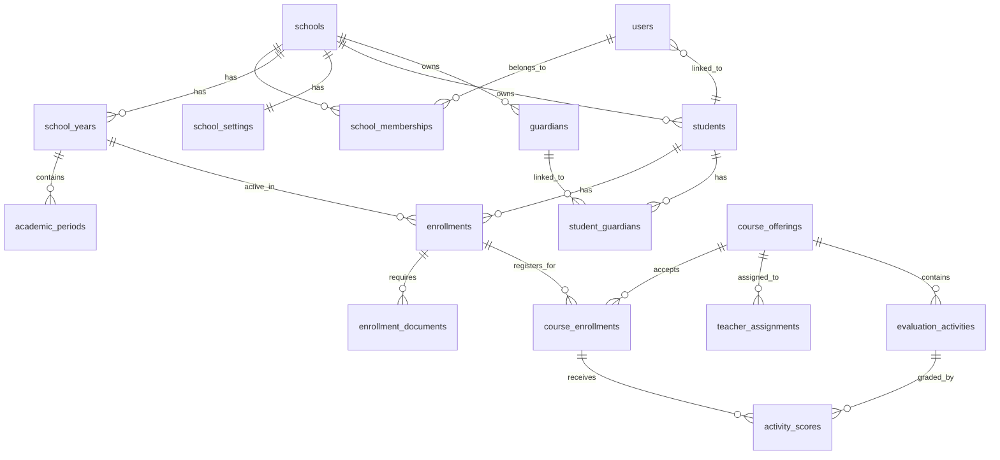

## Schema Overview

Athena uses a **shared database, shared schema** multi-tenant architecture with strict tenant isolation via `school_id` foreign keys in every table.

<Info>
The schema is versioned using Alembic migrations in `/alembic/versions/`. All structural changes must go through migrations.
</Info>

---

## Core Principles

### 1. Tenant Isolation

Every table (except `schools`) includes `school_id`:

```sql
CREATE TABLE students (
    id UUID PRIMARY KEY,
    school_id UUID NOT NULL REFERENCES schools(id),
    -- other fields
);

CREATE INDEX idx_students_tenant ON students(school_id);
```

### 2. Composite Indexes

All queries filter by tenant first:

```sql
-- Single-column index (basic)
CREATE INDEX idx_students_school ON students(school_id);

-- Composite index (optimized)
CREATE INDEX idx_students_school_name ON students(school_id, full_name);
```

<Tip>
Composite indexes `(school_id, other_field)` are critical for performance with 50+ tenants.
</Tip>

### 3. JSONB for Flexibility

Flexible metadata uses JSONB:

- `students.extra_data` - Custom fields per school
- `students.piar_data` - Special education plans (PIAR/DUA)
- `enrollments.status_history` - Audit trail of status changes
- `enrollments.simat_status` - SIMAT sync metadata

```python
# SQLAlchemy model
from sqlalchemy.dialects.postgresql import JSONB

extra_data: Mapped[dict] = mapped_column(
    JSONB,
    nullable=False,
    default=dict,
    server_default="'{}'::jsonb"
)
```

---

## Schema Modules

### Tenant & Configuration

<AccordionGroup>
  <Accordion title="schools" icon="building">
    **Purpose:** Root tenant entity
    
    ```sql
    CREATE TABLE schools (
        id UUID PRIMARY KEY DEFAULT gen_random_uuid(),
        name VARCHAR(255) NOT NULL,
        nit VARCHAR(20),
        resolution VARCHAR(100),
        is_active BOOLEAN NOT NULL DEFAULT true,
        created_at TIMESTAMPTZ NOT NULL DEFAULT now(),
        updated_at TIMESTAMPTZ NOT NULL DEFAULT now()
    );
    
    CREATE UNIQUE INDEX uq_schools_nit ON schools(nit) WHERE nit IS NOT NULL;
    ```
    
    **Key Points:**
    - `nit` - Colombian tax ID (unique when present)
    - `resolution` - Ministry of Education approval number
    - Soft delete via `is_active` flag
  </Accordion>
  
  <Accordion title="school_settings" icon="gear">
    **Purpose:** Institution-wide configuration
    
    ```sql
    CREATE TABLE school_settings (
        school_id UUID PRIMARY KEY REFERENCES schools(id) ON DELETE CASCADE,
        pei_summary TEXT,
        simat_settings JSONB NOT NULL DEFAULT '{}'::jsonb,
        branding_settings JSONB NOT NULL DEFAULT '{}'::jsonb,
        security_settings JSONB NOT NULL DEFAULT '{}'::jsonb,
        habeas_data_text TEXT,
        updated_at TIMESTAMPTZ NOT NULL DEFAULT now()
    );
    ```
    
    **JSONB Examples:**
    - `simat_settings`: `{"institution_code": "123456", "export_encoding": "latin-1"}`
    - `branding_settings`: `{"logo_url": "...", "primary_color": "#..."}`
  </Accordion>
  
  <Accordion title="school_years" icon="calendar">
    **Purpose:** Academic year management
    
    ```sql
    CREATE TABLE school_years (
        id UUID PRIMARY KEY DEFAULT gen_random_uuid(),
        school_id UUID NOT NULL REFERENCES schools(id),
        name VARCHAR(30) NOT NULL,
        starts_on DATE NOT NULL,
        ends_on DATE NOT NULL,
        status VARCHAR(20) NOT NULL DEFAULT 'planning',
        created_at TIMESTAMPTZ NOT NULL DEFAULT now(),
        updated_at TIMESTAMPTZ NOT NULL DEFAULT now(),
        
        CONSTRAINT chk_school_years_status 
            CHECK (status IN ('planning', 'active', 'closed', 'archived')),
        CONSTRAINT chk_school_years_dates 
            CHECK (ends_on >= starts_on)
    );
    
    CREATE UNIQUE INDEX uq_school_years_school_name 
        ON school_years(school_id, name);
    ```
  </Accordion>
  
  <Accordion title="academic_periods" icon="calendar-days">
    **Purpose:** Grading periods within a school year
    
    ```sql
    CREATE TABLE academic_periods (
        id UUID PRIMARY KEY DEFAULT gen_random_uuid(),
        school_id UUID NOT NULL REFERENCES schools(id),
        school_year_id UUID NOT NULL REFERENCES school_years(id) ON DELETE CASCADE,
        number INT NOT NULL CHECK (number >= 1),
        name VARCHAR(50) NOT NULL,
        starts_on DATE NOT NULL,
        ends_on DATE NOT NULL,
        status VARCHAR(20) NOT NULL DEFAULT 'draft',
        
        CONSTRAINT chk_academic_periods_status 
            CHECK (status IN ('draft', 'open', 'closed', 'published'))
    );
    
    CREATE UNIQUE INDEX uq_academic_periods_school_year_number 
        ON academic_periods(school_id, school_year_id, number);
    ```
  </Accordion>
</AccordionGroup>

---

### Users & Identity

<AccordionGroup>
  <Accordion title="users" icon="user">
    **Purpose:** System accounts (mirrors Supabase Auth)
    
    ```sql
    CREATE TABLE users (
        id UUID PRIMARY KEY,  -- Same as Supabase Auth UUID
        email VARCHAR(255) NOT NULL,
        full_name VARCHAR(255) NOT NULL,
        is_active BOOLEAN NOT NULL DEFAULT true,
        created_at TIMESTAMPTZ NOT NULL DEFAULT now(),
        updated_at TIMESTAMPTZ NOT NULL DEFAULT now()
    );
    
    CREATE UNIQUE INDEX uq_users_email ON users(lower(email));
    ```
    
    <Warning>
    **Do not store passwords here.** All auth is handled by Supabase. This table stores metadata only.
    </Warning>
  </Accordion>
  
  <Accordion title="school_memberships" icon="building-user">
    **Purpose:** Links users to schools with roles
    
    ```sql
    CREATE TABLE school_memberships (
        id UUID PRIMARY KEY DEFAULT gen_random_uuid(),
        school_id UUID NOT NULL REFERENCES schools(id) ON DELETE CASCADE,
        user_id UUID NOT NULL REFERENCES users(id) ON DELETE CASCADE,
        roles JSONB NOT NULL DEFAULT '[]'::jsonb,
        is_active BOOLEAN NOT NULL DEFAULT true,
        created_at TIMESTAMPTZ NOT NULL DEFAULT now(),
        updated_at TIMESTAMPTZ NOT NULL DEFAULT now()
    );
    
    CREATE UNIQUE INDEX uq_school_memberships_school_user 
        ON school_memberships(school_id, user_id);
    ```
    
    **Roles Example:**
    ```json
    ["rector", "teacher"]
    ```
    
    Supported roles: `rector`, `coordinator`, `secretary`, `teacher`, `student`, `acudiente`, `superadmin`
  </Accordion>
</AccordionGroup>

---

### Students & Guardians

<AccordionGroup>
  <Accordion title="students" icon="user-graduate">
    **Purpose:** Student profiles
    
    ```sql
    CREATE TABLE students (
        id UUID PRIMARY KEY DEFAULT gen_random_uuid(),
        school_id UUID NOT NULL REFERENCES schools(id),
        user_id UUID REFERENCES users(id) ON DELETE SET NULL,
        document_type VARCHAR(10) NOT NULL,  -- TI, RC, CC, CE
        document_number VARCHAR(30) NOT NULL,
        full_name VARCHAR(255) NOT NULL,
        birth_date DATE,
        gender VARCHAR(20),
        is_active BOOLEAN NOT NULL DEFAULT true,
        extra_data JSONB NOT NULL DEFAULT '{}'::jsonb,
        piar_data JSONB NOT NULL DEFAULT '{}'::jsonb,
        created_at TIMESTAMPTZ NOT NULL DEFAULT now(),
        updated_at TIMESTAMPTZ NOT NULL DEFAULT now()
    );
    
    CREATE UNIQUE INDEX uq_students_school_document 
        ON students(school_id, document_type, document_number);
    CREATE INDEX idx_students_school_name ON students(school_id, full_name);
    ```
    
    **Key Points:**
    - `user_id` is nullable - not all students have system access
    - `piar_data` stores PIAR/DUA plans (Ley 1421/2017)
    - Document uniqueness enforced per tenant
  </Accordion>
  
  <Accordion title="guardians" icon="user-shield">
    **Purpose:** Parent/guardian information (no system access)
    
    ```sql
    CREATE TABLE guardians (
        id UUID PRIMARY KEY DEFAULT gen_random_uuid(),
        school_id UUID NOT NULL REFERENCES schools(id),
        document_type VARCHAR(10) NOT NULL,
        document_number VARCHAR(30) NOT NULL,
        full_name VARCHAR(255) NOT NULL,
        phone VARCHAR(30),
        email VARCHAR(255),
        address TEXT,
        occupation VARCHAR(150),
        workplace VARCHAR(150),
        is_active BOOLEAN NOT NULL DEFAULT true,
        created_at TIMESTAMPTZ NOT NULL DEFAULT now(),
        updated_at TIMESTAMPTZ NOT NULL DEFAULT now()
    );
    
    CREATE UNIQUE INDEX uq_guardians_school_document 
        ON guardians(school_id, document_type, document_number);
    ```
    
    <Info>
    Guardians do **not** have user accounts. They exist only as administrative records linked to students.
    </Info>
  </Accordion>
  
  <Accordion title="student_guardians" icon="link">
    **Purpose:** Student-guardian relationships
    
    ```sql
    CREATE TABLE student_guardians (
        id UUID PRIMARY KEY DEFAULT gen_random_uuid(),
        school_id UUID NOT NULL REFERENCES schools(id),
        student_id UUID NOT NULL REFERENCES students(id) ON DELETE CASCADE,
        guardian_id UUID NOT NULL REFERENCES guardians(id) ON DELETE CASCADE,
        relationship VARCHAR(50) NOT NULL,  -- padre, madre, abuelo, tío, etc.
        is_primary BOOLEAN NOT NULL DEFAULT false,
        priority INT NOT NULL DEFAULT 1,
        can_pickup BOOLEAN NOT NULL DEFAULT false,
        is_emergency_contact BOOLEAN NOT NULL DEFAULT false,
        created_at TIMESTAMPTZ NOT NULL DEFAULT now()
    );
    
    CREATE UNIQUE INDEX uq_student_guardians_school_pair 
        ON student_guardians(school_id, student_id, guardian_id);
    CREATE INDEX idx_student_guardians_student_priority 
        ON student_guardians(school_id, student_id, priority);
    ```
  </Accordion>
</AccordionGroup>

---

### Enrollment

<AccordionGroup>
  <Accordion title="enrollments" icon="clipboard-check">
    **Purpose:** Student enrollment per academic year
    
    ```sql
    CREATE TABLE enrollments (
        id UUID PRIMARY KEY DEFAULT gen_random_uuid(),
        school_id UUID NOT NULL REFERENCES schools(id),
        student_id UUID NOT NULL REFERENCES students(id) ON DELETE CASCADE,
        school_year_id UUID NOT NULL REFERENCES school_years(id) ON DELETE CASCADE,
        grade_level VARCHAR(20) NOT NULL,
        group_code VARCHAR(10),
        shift VARCHAR(20),  -- morning, afternoon, full_day, night
        status VARCHAR(30) NOT NULL DEFAULT 'pending_documents',
        status_history JSONB NOT NULL DEFAULT '[]'::jsonb,
        simat_status JSONB NOT NULL DEFAULT '{}'::jsonb,
        extra_data JSONB NOT NULL DEFAULT '{}'::jsonb,
        created_at TIMESTAMPTZ NOT NULL DEFAULT now(),
        updated_at TIMESTAMPTZ NOT NULL DEFAULT now()
    );
    
    CREATE UNIQUE INDEX uq_enrollments_school_student_year 
        ON enrollments(school_id, student_id, school_year_id);
    CREATE INDEX idx_enrollments_school_status ON enrollments(school_id, status);
    ```
    
    **Status Flow:**
    `pending_documents` → `in_review` → `active` → `graduated` | `withdrawn`
    
    **Status History Example:**
    ```json
    [
      {
        "status": "pending_documents",
        "changed_at": "2026-01-12T08:00:00Z",
        "changed_by": "uuid",
        "reason": "Creación inicial"
      },
      {
        "status": "active",
        "changed_at": "2026-01-18T11:24:00Z",
        "changed_by": "uuid",
        "reason": "Documentos completos"
      }
    ]
    ```
  </Accordion>
  
  <Accordion title="enrollment_documents" icon="file-pdf">
    **Purpose:** Track required documents for enrollment (including consent forms)
    
    ```sql
    CREATE TABLE enrollment_documents (
        id UUID PRIMARY KEY DEFAULT gen_random_uuid(),
        school_id UUID NOT NULL REFERENCES schools(id),
        enrollment_id UUID NOT NULL REFERENCES enrollments(id) ON DELETE CASCADE,
        document_type VARCHAR(50) NOT NULL,
        status VARCHAR(20) NOT NULL DEFAULT 'pending',
        r2_object_key VARCHAR(500) NOT NULL,
        file_name VARCHAR(255) NOT NULL,
        uploaded_at TIMESTAMPTZ NOT NULL DEFAULT now(),
        validated_at TIMESTAMPTZ,
        validated_by UUID REFERENCES users(id) ON DELETE SET NULL,
        accepted_by_guardian_id UUID REFERENCES guardians(id) ON DELETE SET NULL,
        document_version VARCHAR(50),
        metadata JSONB NOT NULL DEFAULT '{}'::jsonb
    );
    
    CREATE UNIQUE INDEX uq_enrollment_documents_type 
        ON enrollment_documents(school_id, enrollment_id, document_type);
    ```
    
    **Document Types:**
    - `birth_certificate`
    - `identity_document`
    - `report_card`
    - `habeas_data` (consent form)
    - `tratamiento_datos` (data processing consent)
  </Accordion>
</AccordionGroup>

---

### Academic Structure

See the [Database Schema Plan](/architecture/database#academic-tables) for the complete academic module including:

- `academic_areas` - Subject areas (Matemáticas, Ciencias, etc.)
- `subject_catalog` - Subject definitions
- `class_groups` - Physical class groups (10-A, 11-B)
- `study_plans` - Curriculum definition by grade
- `course_offerings` - Subjects offered to groups
- `teacher_assignments` - Teacher-subject assignments with history
- `course_enrollments` - Student enrollment in specific courses
- `evaluation_activities` - Assignments, quizzes, exams
- `activity_scores` - Individual student grades
- `attendance_records` - Daily attendance tracking
- `report_cards` - Period report cards with JSONB items

---

## Index Strategy

### When to Add an Index

<Steps>
  <Step title="Foreign Keys">
    Always index columns used in JOINs
    ```sql
    CREATE INDEX idx_enrollments_student ON enrollments(student_id);
    ```
  </Step>
  
  <Step title="Filter Columns">
    Index columns used in WHERE clauses
    ```sql
    CREATE INDEX idx_enrollments_status ON enrollments(school_id, status);
    ```
  </Step>
  
  <Step title="Sort Columns">
    Index columns used in ORDER BY
    ```sql
    CREATE INDEX idx_students_name ON students(school_id, full_name);
    ```
  </Step>
  
  <Step title="Uniqueness">
    Unique indexes prevent duplicates
    ```sql
    CREATE UNIQUE INDEX uq_students_document 
        ON students(school_id, document_type, document_number);
    ```
  </Step>
</Steps>

### When NOT to Add an Index

<Warning>
- Small tables (< 1000 rows)
- Columns rarely queried
- JSONB columns only read in full (unless you need GIN for deep search)
- Write-heavy tables (indexes slow INSERTs)
</Warning>

---

## Migration Management

### Creating a Migration

```bash
# Auto-generate migration from model changes
alembic revision --autogenerate -m "add_piar_data_to_students"

# Review the generated file in alembic/versions/
# Edit if needed, then apply:
alembic upgrade head
```

### Migration Best Practices

<AccordionGroup>
  <Accordion title="1. Always Review Auto-Generated Migrations">
    Alembic can't detect:
    - Column renames (sees as drop + add)
    - Index changes
    - Check constraint modifications
  </Accordion>
  
  <Accordion title="2. Test Migrations with Data">
    ```python
    # In conftest.py
    @pytest.fixture
    async def db_with_data():
        # Create test data
        # Run migration
        # Verify data integrity
    ```
  </Accordion>
  
  <Accordion title="3. Add Reversible Downgrades">
    ```python
    def upgrade():
        op.add_column('students', sa.Column('piar_data', JSONB, ...))
    
    def downgrade():
        op.drop_column('students', 'piar_data')
    ```
  </Accordion>
</AccordionGroup>

---

## Data Integrity

### Foreign Key Cascade Rules

| Scenario | Action | Example |
|----------|--------|----------|
| Delete school | CASCADE | All related data deleted |
| Delete student | CASCADE | Enrollments deleted |
| Delete user | SET NULL | Preserve records but unlink |
| Delete teacher | RESTRICT | Prevent if has active assignments |

### Check Constraints

```sql
-- Enum-like validation
CONSTRAINT chk_enrollments_status 
    CHECK (status IN ('pending_documents', 'in_review', 'active', 'withdrawn'))

-- Range validation
CONSTRAINT chk_activity_scores_score 
    CHECK (score >= 0 AND score <= 5.0)

-- Date validation
CONSTRAINT chk_school_years_dates 
    CHECK (ends_on >= starts_on)

-- JSONB type validation
CONSTRAINT chk_students_extra_data_object 
    CHECK (jsonb_typeof(extra_data) = 'object')
```

---

## ERD Diagram



---

## Next Steps

<CardGroup cols={2}>
  <Card title="Multi-Tenancy" icon="building" href="/architecture/multi-tenancy">
    Learn how tenant isolation is enforced in queries
  </Card>
  <Card title="API Reference" icon="code" href="/api">
    Explore the REST endpoints that use this schema
  </Card>
</CardGroup>
