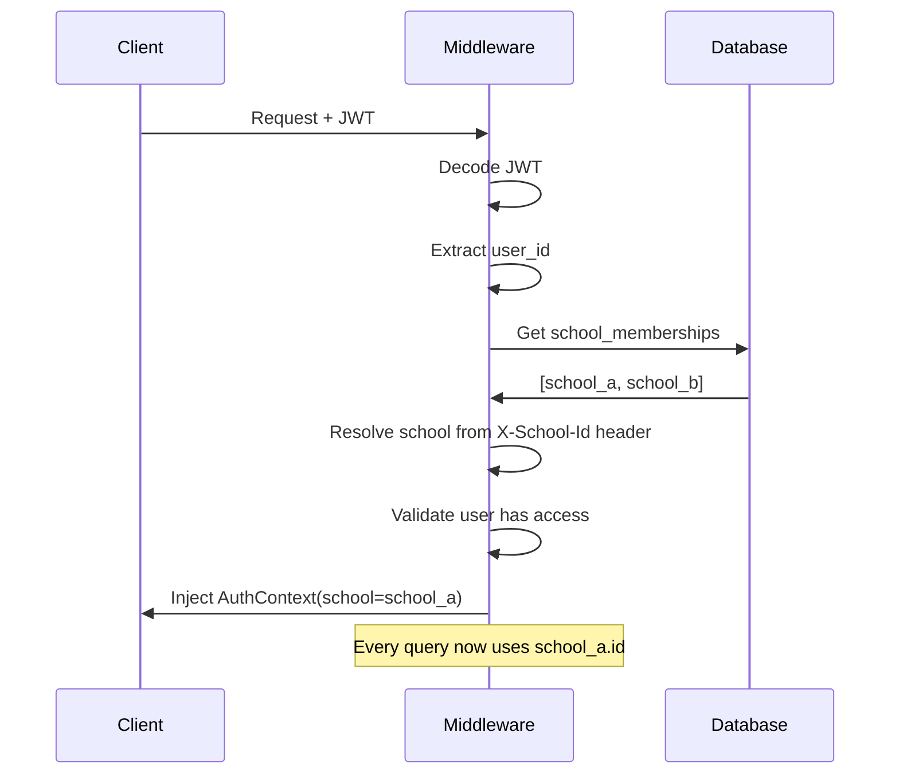
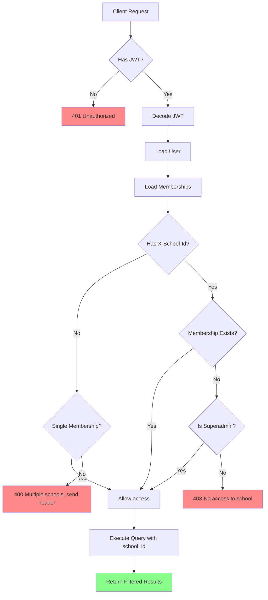

## Overview

Athena uses a **shared database, shared schema** architecture where multiple schools (tenants) share the same PostgreSQL database and tables. Tenant isolation is enforced through:

1. **Database:** Every table has a `school_id` column
2. **Backend:** Middleware automatically injects `school_id` into queries
3. **Frontend:** Users belong to one or more schools via `school_memberships`

<Warning>
**Critical:** Tenant isolation is enforced in the **backend**, not with PostgreSQL Row Level Security (RLS). This is an intentional architectural decision.
</Warning>

---

## Why This Approach?

### Shared Schema Architecture

<CardGroup cols={2}>
  <Card title="✅ Chosen: Shared Schema" icon="database">
    - Single codebase
    - Easy cross-tenant analytics (superadmin)
    - Simple backup/restore
    - Lower operational overhead
    - Cost-effective for 20-40 schools
  </Card>
  
  <Card title="❌ Not Using: Schema-per-Tenant" icon="layer-group">
    - Complex migration management
    - Harder to aggregate data
    - Higher operational cost
    - Only needed at massive scale (1000+ tenants)
  </Card>
</CardGroup>

### Backend Enforcement (No RLS)

<AccordionGroup>
  <Accordion title="✅ Why Backend Enforcement" icon="shield-check">
    **Testable**
    ```python
    # Easy to test isolation
    async def test_tenant_isolation():
        # User from school A tries to access school B data
        response = await client.get("/students", headers={"X-School-Id": school_b})
        assert response.status_code == 403
    ```
    
    **Debuggable**
    - Stack traces show where tenant check happens
    - No hidden database policies
    - Logs show tenant context
    
    **Portable**
    - Works on any PostgreSQL
    - No vendor lock-in to Supabase/RLS
    - Easy to migrate to GCP Cloud SQL
    
    **Centralized Logic**
    - All business rules in Python
    - No split between DB and app
    - Version controlled with Git
  </Accordion>
  
  <Accordion title="❌ Why Not RLS" icon="shield-xmark">
    **Hard to Test**
    - Policies run inside PostgreSQL
    - Harder to mock for unit tests
    - Must set `app.settings.jwt.claims.tenant_id` in every test query
    
    **Hard to Debug**
    - Silent failures (empty results instead of errors)
    - No Python stack trace
    - Must check PostgreSQL logs
    
    **Vendor Lock-In**
    - RLS syntax varies between vendors
    - Migration requires rewriting policies
    - Not all managed services support RLS fully
    
    **Split Logic**
    - Permissions in both database and backend
    - Harder to understand complete flow
    - Two places to update when rules change
  </Accordion>
</AccordionGroup>

<Info>
**Trade-off Accepted:** A bug in backend middleware could leak data. This is mitigated by:
- Comprehensive integration tests for tenant isolation
- Code reviews focused on tenant checks
- Middleware that makes forgetting the filter **the exception, not the rule**
</Info>

---

## How It Works

### 1. Database: Every Table Has `school_id`

```sql
CREATE TABLE students (
    id UUID PRIMARY KEY DEFAULT gen_random_uuid(),
    school_id UUID NOT NULL REFERENCES schools(id),  -- ← Tenant key
    full_name VARCHAR(255) NOT NULL,
    -- ... other fields
);

-- Composite index for performance
CREATE INDEX idx_students_tenant ON students(school_id);
CREATE INDEX idx_students_tenant_name ON students(school_id, full_name);
```

<Warning>
The **only** table without `school_id` is `schools` itself (the tenant root).
</Warning>

---

### 2. Backend: Automatic Tenant Injection

#### Middleware Flow



#### Implementation: deps.py

<CodeGroup>
```python deps.py
from fastapi import Depends, Header, HTTPException
from app.models.school import School

@dataclass
class AuthContext:
    user: User
    payload: TokenPayload
    membership: SchoolMembership | None = None
    school: School | None = None
    
    @property
    def school_id(self) -> uuid.UUID | None:
        return self.school.id if self.school else None

async def get_auth_context(
    x_school_id: uuid.UUID | None = Header(None, alias="X-School-Id"),
    current_user: User = Depends(get_current_user),
    db: AsyncSession = Depends(get_db),
) -> AuthContext:
    # Get user's memberships
    result = await db.execute(
        select(SchoolMembership).where(
            SchoolMembership.user_id == current_user.id,
            SchoolMembership.is_active.is_(True),
        )
    )
    memberships = list(result.scalars().all())
    
    # Resolve requested school
    if x_school_id:
        membership = next(
            (m for m in memberships if m.school_id == x_school_id),
            None
        )
        if not membership and not is_superadmin(current_user):
            raise HTTPException(403, "No access to this school")
    
    # Load school
    school = await db.get(School, x_school_id)
    
    return AuthContext(
        user=current_user,
        membership=membership,
        school=school,
        memberships=memberships,
    )

async def get_current_tenant(
    auth: AuthContext = Depends(get_auth_context),
) -> School:
    """Dependency that requires a school context."""
    if auth.school is None:
        raise HTTPException(403, "No school context")
    return auth.school
```

```python Usage in Routes
from app.deps import get_current_tenant, AuthContext

@router.get("/students")
async def list_students(
    tenant: School = Depends(get_current_tenant),  # ← Injects school
    db: AsyncSession = Depends(get_db),
):
    # tenant.id is ALWAYS set here
    result = await db.execute(
        select(Student)
        .where(Student.school_id == tenant.id)  # ← Automatic isolation
        .order_by(Student.full_name)
    )
    students = result.scalars().all()
    return [StudentOut.model_validate(s) for s in students]
```
</CodeGroup>

<Tip>
**Best Practice:** Every endpoint should depend on `get_current_tenant` or `get_auth_context`. This makes forgetting the `school_id` filter **impossible**.
</Tip>

---

### 3. Frontend: School Selection

#### Single-School Users

```typescript
// User belongs to only one school
const authStore = useAuthStore();

// Auth store automatically sets X-School-Id header
const students = await api.get('/students');
// → Filtered to user's school automatically
```

#### Multi-School Users (Superadmin)

```typescript
// Superadmin can access multiple schools
const [activeSchool, setActiveSchool] = useState<School | null>(null);

// Explicitly set school context
const students = await api.get('/students', {
  headers: {
    'X-School-Id': activeSchool.id
  }
});
```

<Info>
The frontend Axios client automatically injects `X-School-Id` from Zustand auth store for all requests.
</Info>

---

## Roles & Permissions

### Role Definitions

<CodeGroup>
```python permissions.py
from enum import StrEnum

class Role(StrEnum):
    SUPERADMIN = "superadmin"    # Multi-tenant access
    RECTOR = "rector"            # School admin
    COORDINATOR = "coordinator"  # Academic + discipline
    SECRETARY = "secretary"      # Enrollment + comms
    TEACHER = "teacher"          # Grades + attendance
    STUDENT = "student"          # Read own data
    GUARDIAN = "acudiente"       # Read child data

ROLE_PERMISSIONS: dict[Role, set[str]] = {
    Role.SUPERADMIN: {
        "read:all", "write:all", "delete:all",
        "manage:schools",  # ← Can bypass tenant checks
        "manage:users",
    },
    Role.RECTOR: {
        "read:all", "write:all", "delete:all",
        "config:institution",
        "manage:users",
    },
    Role.COORDINATOR: {
        "read:students", "read:grades",
        "write:convivencia", "write:due_process",
    },
    Role.SECRETARY: {
        "read:students", "write:enrollment",
        "write:communications",
    },
    Role.TEACHER: {
        "read:own_students", "write:grades",
        "write:attendance", "read:schedule",
    },
    Role.STUDENT: {
        "read:own_data", "read:own_grades",
    },
}
```

```python Usage
from app.deps import require_permissions

@router.post("/enrollments")
async def create_enrollment(
    data: EnrollmentCreate,
    auth: AuthContext = Depends(
        require_permissions("write:enrollment")
    ),
    db: AsyncSession = Depends(get_db),
):
    # Only users with "write:enrollment" can reach here
    # auth.school is guaranteed to be set
    enrollment = Enrollment(
        school_id=auth.school.id,
        **data.model_dump(),
    )
    db.add(enrollment)
    await db.commit()
    return enrollment
```
</CodeGroup>

### Superadmin Special Case

<Warning>
**Superadmin** can access any school by sending `X-School-Id` header, even if not a member.
</Warning>

```python
# In get_auth_context()
if not membership and not has_permission(auth.roles, "manage:schools"):
    raise HTTPException(403, "No access to this school")

# Superadmin bypasses membership check
if has_permission(["superadmin"], "manage:schools"):
    # Can load ANY school_id
    school = await db.get(School, x_school_id)
```

---

## Testing Tenant Isolation

### Integration Test Pattern

```python
# tests/test_tenant_isolation.py
import pytest
from httpx import AsyncClient

@pytest.mark.asyncio
async def test_cannot_access_other_tenant_students(
    client: AsyncClient,
    school_a: School,
    school_b: School,
    user_a: User,  # Member of school_a only
):
    """User from school A cannot see school B students."""
    
    # Create student in school B
    student_b = Student(school_id=school_b.id, full_name="Bob")
    # ... save to DB
    
    # Login as user from school A
    token = create_access_token(user_a.id, school_id=school_a.id)
    
    # Try to access school B data
    response = await client.get(
        "/students",
        headers={
            "Authorization": f"Bearer {token}",
            "X-School-Id": str(school_b.id),  # ← Attempt to access school B
        },
    )
    
    # Should be forbidden
    assert response.status_code == 403
    assert "No access to this school" in response.json()["detail"]
```

### Test Coverage Checklist

<Steps>
  <Step title="Cross-Tenant Read">
    User from school A tries to list school B data
    → Should get 403
  </Step>
  
  <Step title="Cross-Tenant Write">
    User from school A tries to create data with `school_id=school_b`
    → Should get 403 or ignore the field
  </Step>
  
  <Step title="Cross-Tenant Update">
    User from school A tries to update school B record by ID
    → Should get 404 (filtered query returns nothing)
  </Step>
  
  <Step title="Superadmin Access">
    Superadmin with `manage:schools` permission
    → Should be able to access any school with X-School-Id header
  </Step>
</Steps>

---

## Performance Considerations

### Index Strategy

<Warning>
**Without proper indexes, multi-tenancy kills performance.**
</Warning>

#### ❌ Bad: Single-column index

```sql
CREATE INDEX idx_students_school ON students(school_id);

-- Query still scans entire table then filters
SELECT * FROM students WHERE school_id = 'xxx' ORDER BY full_name;
```

#### ✅ Good: Composite index

```sql
CREATE INDEX idx_students_school_name ON students(school_id, full_name);

-- Query uses index for both filter AND sort
SELECT * FROM students WHERE school_id = 'xxx' ORDER BY full_name;
```

### Query Patterns

<CodeGroup>
```python Good: Tenant-first
# Always filter by school_id first
result = await db.execute(
    select(Student)
    .where(Student.school_id == tenant.id)  # ← First
    .where(Student.is_active.is_(True))      # ← Then other filters
    .order_by(Student.full_name)
)
```

```python Bad: No tenant filter
# NEVER query without school_id
result = await db.execute(
    select(Student)
    .where(Student.document_number == doc_number)
)
# ⚠️ Returns students from ALL schools!
```
</CodeGroup>

---

## Security Checklist

<AccordionGroup>
  <Accordion title="✅ Backend" icon="server">
    - [ ] Every endpoint depends on `get_current_tenant` or `get_auth_context`
    - [ ] Every query includes `WHERE school_id = tenant.id`
    - [ ] Superadmin bypass explicitly checked with `has_permission("manage:schools")`
    - [ ] Foreign key references validated within same tenant
    - [ ] Integration tests verify 403 on cross-tenant access
  </Accordion>
  
  <Accordion title="✅ Database" icon="database">
    - [ ] Every table (except `schools`) has `school_id` column
    - [ ] Foreign keys include `school_id` for composite uniqueness
    - [ ] Indexes always start with `school_id`
    - [ ] No direct SQL queries bypass ORM (unless explicitly tenant-filtered)
  </Accordion>
  
  <Accordion title="✅ Frontend" icon="browser">
    - [ ] Axios interceptor always sends `X-School-Id` header
    - [ ] Multi-school users explicitly select active school
    - [ ] School context displayed in UI (navbar, breadcrumbs)
    - [ ] No hardcoded school IDs in code
  </Accordion>
</AccordionGroup>

---

## Migration Path

If you later need **schema-per-tenant**:

<Steps>
  <Step title="Phase 1: Add tenant_schema column">
    ```sql
    ALTER TABLE schools ADD COLUMN tenant_schema VARCHAR(63);
    ```
  </Step>
  
  <Step title="Phase 2: Create schemas for large tenants">
    ```sql
    CREATE SCHEMA school_abc123;
    CREATE TABLE school_abc123.students AS SELECT * FROM students WHERE school_id = 'abc123';
    ```
  </Step>
  
  <Step title="Phase 3: Route queries to tenant schema">
    ```python
    if tenant.tenant_schema:
        # Use dedicated schema
        db.execute(text(f"SET search_path TO {tenant.tenant_schema}"))
    else:
        # Use shared schema with school_id filter
        query = query.where(Student.school_id == tenant.id)
    ```
  </Step>
  
  <Step title="Phase 4: Gradual migration">
    Migrate schools one by one based on size/growth
  </Step>
</Steps>

<Info>
This architecture makes the migration path **optional** and **gradual**, not required upfront.
</Info>

---

## Common Pitfalls

<AccordionGroup>
  <Accordion title="🚨 Forgetting school_id in WHERE clause" icon="triangle-exclamation">
    **Problem:**
    ```python
    # ❌ Leaks data across tenants
    student = await db.get(Student, student_id)
    ```
    
    **Solution:**
    ```python
    # ✅ Always filter by tenant
    result = await db.execute(
        select(Student).where(
            Student.school_id == tenant.id,
            Student.id == student_id,
        )
    )
    student = result.scalar_one_or_none()
    if not student:
        raise HTTPException(404, "Student not found")
    ```
  </Accordion>
  
  <Accordion title="🚨 Validating foreign keys without tenant check" icon="triangle-exclamation">
    **Problem:**
    ```python
    # ❌ User could reference another school's student
    enrollment = Enrollment(
        school_id=tenant.id,
        student_id=data.student_id,  # Not validated!
    )
    ```
    
    **Solution:**
    ```python
    # ✅ Verify student belongs to tenant
    student = await db.execute(
        select(Student).where(
            Student.school_id == tenant.id,
            Student.id == data.student_id,
        )
    )
    if not student.scalar_one_or_none():
        raise HTTPException(400, "Student not in this school")
    
    enrollment = Enrollment(
        school_id=tenant.id,
        student_id=data.student_id,
    )
    ```
  </Accordion>
  
  <Accordion title="🚨 Missing X-School-Id header" icon="triangle-exclamation">
    **Problem:**
    Multi-school user doesn't send header, gets ambiguous error.
    
    **Solution:**
    ```python
    if len(memberships) > 1 and not x_school_id:
        raise HTTPException(
            400,
            "You belong to multiple schools. Send X-School-Id header."
        )
    ```
  </Accordion>
</AccordionGroup>

---

## Diagram: Request Flow



---

## Next Steps

<CardGroup cols={2}>
  <Card title="Technology Stack" icon="layer-group" href="/architecture/stack">
    Back to the complete tech stack overview
  </Card>
  <Card title="API Reference" icon="code" href="/api">
    See how these patterns apply to specific endpoints
  </Card>
</CardGroup>
