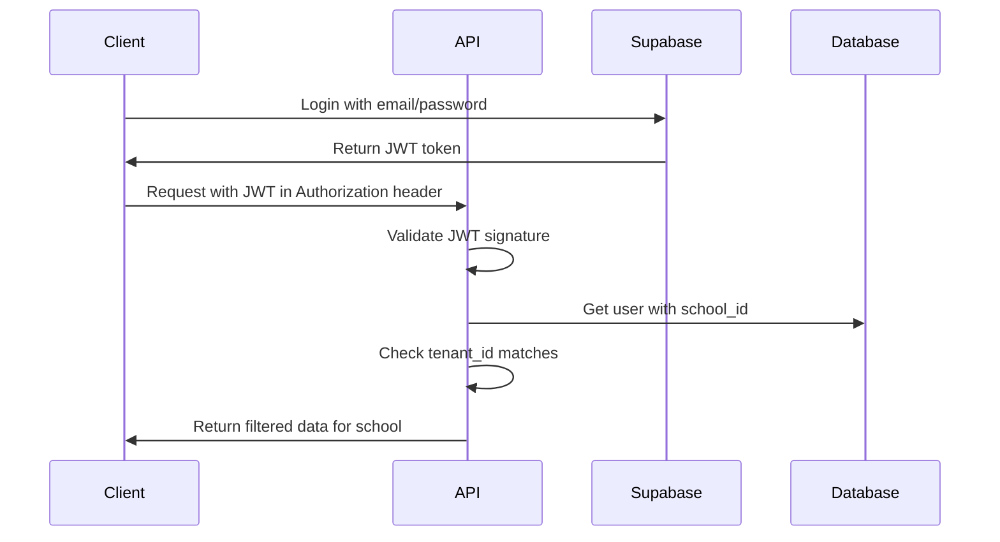

# Quickstart Guide

Get your first Colombian school up and running with Athena ERP in under 5 minutes. This guide walks you through setting up a school, creating users, and enrolling your first student.

<Note>
  This quickstart assumes you have Athena ERP installed locally. If you haven't installed it yet, check out the [Installation Guide](/installation).
</Note>

## Prerequisites

Before you begin, ensure you have:
- Athena ERP backend running on `http://localhost:8000`
- Athena ERP frontend running on `http://localhost:3000`
- PostgreSQL database initialized with migrations
- A Supabase account (optional for local development)

## Step 1: Create Your First School

<Steps>
  <Step title="Access the API">
    First, verify your API is running by checking the health endpoint:
    
    ```bash
    curl http://localhost:8000/health
    ```
    
    You should see:
    ```json
    {"status": "ok", "version": "0.1.0"}
    ```
  </Step>

  <Step title="Create a superadmin user">
    Run the provided script to create your first administrator:
    
    ```bash
    cd athena-api
    PYTHONPATH=. python scripts/create_superadmin.py \
      --id $(uuidgen) \
      --email admin@myschool.edu.co \
      --full-name "Administrator" \
      --membership-roles superadmin
    ```
    
    <Note>
      The script is idempotent - you can run it multiple times safely. It will create or update the user.
    </Note>
  </Step>

  <Step title="Log in to the frontend">
    Open your browser and navigate to `http://localhost:3000`. Use the credentials you just created to log in.
  </Step>

  <Step title="Configure your school">
    Navigate to **Settings** → **Institution** and fill in your school's basic information:
    
    - **Name**: Your school's name (e.g., "Colegio San José")
    - **NIT**: Tax identification number
    - **Resolution**: Ministry of Education resolution number
    - **PEI Summary**: Brief description of your Institutional Educational Project
    
    This information can be updated via API:
    
    ```python
    # Using the Python client
    from app.routers.schools import update_my_school
    
    school_data = {
        "name": "Colegio San José",
        "nit": "900123456-7",
        "resolution": "Resolución 001234 de 2024",
        "settings": {
            "pei_summary": "Formación integral con énfasis en valores"
        }
    }
    ```
  </Step>
</Steps>

## Step 2: Set Up Academic Structure

<Steps>
  <Step title="Create a school year">
    Define your academic year to organize periods and enrollments:
    
    ```bash
    curl -X POST http://localhost:8000/schools/years \
      -H "Content-Type: application/json" \
      -H "Authorization: Bearer YOUR_JWT_TOKEN" \
      -d '{
        "year": 2026,
        "starts_on": "2026-01-20",
        "ends_on": "2026-11-30"
      }'
    ```
  </Step>

  <Step title="Create academic periods">
    Colombian schools typically have 4 periods. Create them for your school year:
    
    ```bash
    curl -X POST http://localhost:8000/schools/periods \
      -H "Content-Type: application/json" \
      -H "Authorization: Bearer YOUR_JWT_TOKEN" \
      -d '{
        "school_year_id": "YOUR_SCHOOL_YEAR_ID",
        "number": 1,
        "name": "Primer Periodo",
        "starts_on": "2026-01-20",
        "ends_on": "2026-03-31",
        "weight_percentage": 25.0
      }'
    ```
    
    Repeat for periods 2, 3, and 4.
  </Step>
</Steps>

## Step 3: Enroll Your First Student

<Steps>
  <Step title="Create a student record">
    Add your first student with guardian information:
    
    ```python
    # Example request to create a student
    student_data = {
        "document_type": "TI",  # Tarjeta de Identidad
        "document_number": "1234567890",
        "full_name": "María García Pérez",
        "birth_date": "2010-05-15",
        "gender": "F",
        "guardians": [
            {
                "document_type": "CC",
                "document_number": "79123456",
                "full_name": "Carlos García",
                "phone": "3001234567",
                "email": "carlos.garcia@example.com",
                "relationship": "Padre",
                "is_primary": true,
                "priority": 1,
                "can_pickup": true,
                "is_emergency_contact": true
            }
        ]
    }
    ```
    
    Send this via the students endpoint:
    ```bash
    curl -X POST http://localhost:8000/students \
      -H "Content-Type: application/json" \
      -H "Authorization: Bearer YOUR_JWT_TOKEN" \
      -d @student_data.json
    ```
  </Step>

  <Step title="Create an enrollment">
    Enroll the student in a grade for the current school year:
    
    ```bash
    curl -X POST http://localhost:8000/enrollments \
      -H "Content-Type: application/json" \
      -H "Authorization: Bearer YOUR_JWT_TOKEN" \
      -d '{
        "student_id": "STUDENT_UUID",
        "school_year_id": "SCHOOL_YEAR_UUID",
        "grade_level": "5to",
        "section": "A",
        "status": "active",
        "enrolled_on": "2026-01-20"
      }'
    ```
  </Step>

  <Step title="Verify the enrollment">
    Check that the student appears in your student list:
    
    ```bash
    curl http://localhost:8000/students?page=1&page_size=20 \
      -H "Authorization: Bearer YOUR_JWT_TOKEN"
    ```
    
    You should see your student in the response with their guardian information.
  </Step>
</Steps>

## Step 4: Explore Key Features

<CardGroup cols={2}>
  <Card title="Student Management" icon="graduation-cap" href="/features/students">
    View, search, and manage student records with full CRUD operations
  </Card>
  
  <Card title="Academic Records" icon="book-open" href="/features/academic">
    Record grades, attendance, and academic observations
  </Card>
  
  <Card title="Communications" icon="envelope" href="/features/communications">
    Send notifications and circulars to students and guardians
  </Card>
  
  <Card title="Discipline" icon="gavel" href="/features/discipline">
    Track behavioral incidents and disciplinary actions
  </Card>
</CardGroup>

## Bulk Student Import

For schools with existing student databases, use the bulk import endpoint:

```bash
curl -X POST http://localhost:8000/students/bulk \
  -H "Authorization: Bearer YOUR_JWT_TOKEN" \
  -F "file=@students.csv"
```

<Accordion title="CSV Format Requirements">
  Your CSV file should include these columns:
  
  - `nombre_completo` or `full_name` (required)
  - `numero_documento` or `document_number` (required)
  - `tipo_documento` or `document_type` (optional, defaults to "TI")
  - `gender` or `genero` (optional)
  
  Example CSV:
  ```csv
  nombre_completo,numero_documento,tipo_documento,genero
  María García Pérez,1234567890,TI,F
  Juan Rodríguez López,0987654321,TI,M
  ```
  
  The API returns:
  ```json
  {
    "message": "Proceso completado",
    "processed": 2,
    "errors": []
  }
  ```
</Accordion>

## Next Steps

<Steps>
  <Step title="Configure Roles">
    Set up teachers, coordinators, and other staff with appropriate permissions. See [User Management](/admin/users).
  </Step>
  
  <Step title="Customize Settings">
    Configure grade levels, subjects, and institutional branding. See [School Settings](/admin/settings).
  </Step>
  
  <Step title="Integrate Supabase">
    For production deployments, configure Supabase authentication. See [Supabase Integration](/architecture/infrastructure/supabase).
  </Step>
  
  <Step title="Enable File Storage">
    Connect Cloudflare R2 for document storage. See [Cloudflare R2](/architecture/infrastructure/cloudflare-r2).
  </Step>
</Steps>

## Authentication Flow

Athena ERP uses JWT-based authentication. Here's how the flow works:



<Note>
  All API requests automatically filter by `school_id` (tenant) to ensure data isolation between schools. You never need to manually specify the school in your requests.
</Note>

## Common Operations

### Check User Profile

```bash
curl http://localhost:8000/auth/me \
  -H "Authorization: Bearer YOUR_JWT_TOKEN"
```

Response:
```json
{
  "id": "287eaeb8-1021-49d6-8bc5-97b2b530d76c",
  "email": "admin@myschool.edu.co",
  "full_name": "Administrator",
  "is_active": true,
  "roles": ["superadmin"],
  "school_id": "550e8400-e29b-41d4-a716-446655440000",
  "memberships": []
}
```

### Search Students

```bash
# Search by name or document
curl "http://localhost:8000/students?search=Maria&page=1" \
  -H "Authorization: Bearer YOUR_JWT_TOKEN"

# Filter by grade
curl "http://localhost:8000/students?grade=5to&page=1" \
  -H "Authorization: Bearer YOUR_JWT_TOKEN"
```

### Get Student Details

```bash
curl http://localhost:8000/students/STUDENT_UUID \
  -H "Authorization: Bearer YOUR_JWT_TOKEN"
```

## Troubleshooting

<AccordionGroup>
  <Accordion title="JWT token expired">
    Tokens expire after 30 minutes by default. Re-authenticate to get a fresh token:
    
    ```python
    # In config.py
    access_token_expire_minutes: int = 30
    ```
    
    Implement token refresh on the frontend using Supabase's session management.
  </Accordion>
  
  <Accordion title="CORS errors">
    Ensure your frontend URL is listed in `CORS_ORIGINS`:
    
    ```bash
    # In .env
    CORS_ORIGINS=http://localhost:3000,http://localhost:5173
    ```
  </Accordion>
  
  <Accordion title="Database connection errors">
    Verify your PostgreSQL container is running:
    
    ```bash
    docker compose ps
    # Should show 'db' service as 'running'
    
    # Check health
    docker compose exec db pg_isready -U athena -d athena_db
    ```
  </Accordion>
  
  <Accordion title="Duplicate student error">
    Each student's `document_number` + `document_type` must be unique within a school:
    
    ```
    409 Conflict: Ya existe un estudiante con ese documento en este colegio
    ```
    
    Check for existing records before creating:
    ```bash
    curl "http://localhost:8000/students?search=1234567890" \
      -H "Authorization: Bearer YOUR_JWT_TOKEN"
    ```
  </Accordion>
</AccordionGroup>

## API Reference

For complete API documentation, visit:

- **Local Development**: [http://localhost:8000/docs](http://localhost:8000/docs) (Swagger UI)
- **ReDoc**: [http://localhost:8000/redoc](http://localhost:8000/redoc)
- **OpenAPI Schema**: [http://localhost:8000/openapi.json](http://localhost:8000/openapi.json)

<Warning>
  The interactive API docs (`/docs` and `/redoc`) are only available in development mode. They are automatically disabled in production for security.
</Warning>

## Need Help?

<CardGroup cols={2}>
  <Card title="Installation Guide" icon="download" href="/installation">
    Detailed setup instructions for local development
  </Card>
  
  <Card title="API Reference" icon="code" href="/api-reference">
    Complete endpoint documentation with examples
  </Card>
  
  <Card title="Contributing" icon="github" href="/CONTRIBUTING">
    Learn how to contribute to Athena ERP
  </Card>
  
  <Card title="GitHub Issues" icon="bug" href="https://github.com/yourusername/athena-erp">
    Report bugs or request features
  </Card>
</CardGroup>